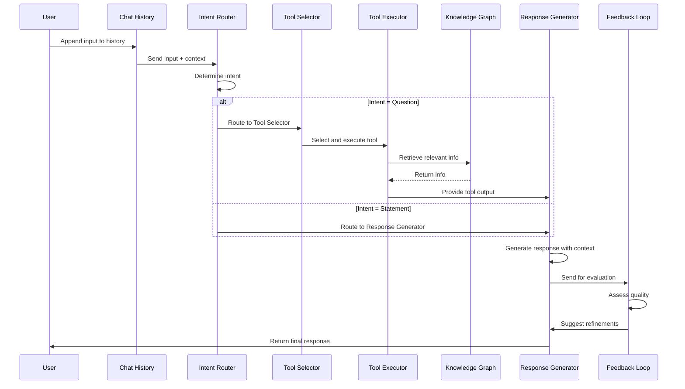

# Notes

Currently if the document is uploaded, then the case_path attribute needs to be manually set in registry.json 
to ensure the folder structure is seen else files will be under un-categorized.

## Future Enhancements

- [ ] Sidebar and DASH modal integration
- [ ] Regenerated messages should be multi-view
- [ ] Remove welcome message from backend
- [ ] Add copy and feedback icons and api to frontend
- [x] Check why sources are not showing up
- [x] ability to interact with doc processings - what failed
- [x] Filter expressions for text and table content from vector db
- [x] Emulate DASH using AG Grid 
    - [ ] Complexity - considering folder structure as an upload.-- ADD MANUALLY. 
    - [x] Deciding migration of `registry.json`
- [x] Stream response

[ ] Internal knowledge base of SOPs
[ ] FAQ for non client, Chatbot for client data, internal chatbot for sop data
[ ] use case to model map

---

- [x] ag grid interact
- [x] doc process tracking
- [ ] AI int for long context answer generation
    1. i have already implemented a heirarchical chunking and indexing strategy,

    2. a hybrid retrieval - (vector + keyword/sparse search like BM25) to catch both conceptual relevance and exact term matches. 
        2.1 can re rank on a translated query

    3. i have my own twist to query focused selection- each of my documents has a metadata, so i was thinking of having a smart document router which passes what to search in what document to bring back results.

    4. I was thinking of including a smart token filler that dynamically adjusts the top_k parameter based on available prompt space, optimizing for more sources when chat history is small and reducing as it grows.

embeddings generatED folder structure

## STUBBBB

## Advanced

- Retry mechanism and mid-process persistence
case user role documents

### errors:

Comparison & Recommendations:
If precision and the quality of top-ranked documents matter: Reciprocal Rank Fusion (RRF) is a good option as it emphasizes documents that appear at the top of either search system.

If the goal is to maximize the number of relevant documents: CombSUM and CombMNZ are solid choices, with CombSUM ensuring broad relevance, and CombMNZ focusing on non-zero matches.

If you want to prioritize the best documents: CombMAX ensures that only the best results from each search method are considered, which is great if the systems are generally reliable but may have some inconsistencies in ranking.

If the systems' score ranges differ: Logarithmic Scaling before Combination is useful to normalize and avoid bias towards one method.

If you have strong confidence in one method: Weighted Ranking lets you give more importance to one of the search methods, allowing you to tune the balance.

Final Choice:
The optimal method will depend on the specific nature of your dataset, the retrieval systems, and the type of queries you are handling. A balanced, flexible approach like Weighted Ranking or RRF will usually be the best starting point, with CombSUM or CombMAX as possible alternatives for simpler, more direct combinations.

Document Selection with AG Grid: Summary & Plan

I want:

Documents organized in a hierarchical folder structure (e.g., A/doc_abc.pdf)

Implemented using AG Grid with tree data nesting features

Rich metadata display beyond what's in registry.json

Selected document IDs passed to existing API functions

Steps Taken

Initial Setup

Created a data transformer utility to convert flat document lists into hierarchical tree structure

Implemented mock metadata generation (importance, size, page counts)

Organized documents into department-based folders (Legal, Finance, HR, etc.)

AG Grid Component Implementation

Built a custom AG Grid document selector component

Configured tree data structure with proper parent-child relationships

Added document selection capability with checkboxes

Implemented visual indicators (folder/file icons, status badges)

Error Resolution

Fixed module registration by using AllEnterpriseModule

Resolved theming conflict by setting theme="legacy"

Ensured component properly integrates with existing application

Plan for Continuing Development

Enhanced Filtering & Searching

Implement advanced filtering options for each column

Add global search functionality to quickly find documents

Allow filtering by document metadata (status, importance, etc.)

Improved User Experience

Add sorting for each column

Implement expand/collapse all functionality

Add context menus for additional actions

Visual Enhancements

Improve folder/file styling and visual hierarchy

Add tooltips for additional information on hover

Implement document previews on selection

Data Management

Improve document metadata extraction from actual files

Add better folder organization logic (perhaps date-based or by document type)

Implement document grouping preferences

Integration Refinement

Ensure seamless integration with chat creation workflow

Test with larger document sets for performance

Add proper error handling and loading states

With these improvements, the document selector will provide a powerful and intuitive interface for users to find and select documents for chat sessions.

llama 4 diagram:

